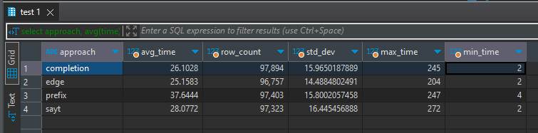
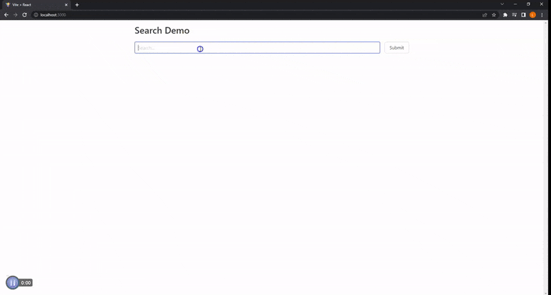

# Opensearch Demo
This is a proof of concept that presents how to use opensearch.

## Background
Using opensearch has three general steps: defining the index, adding data, and querying the index. An index is like a collection in NoSQL databases. The schema could be defined, or you could let opensearch automatically define the schema. Defining the schema is the same as defining the index. The index is defined with a PUT request. An example of the payload is in /opensearch/index/. Adding data is done with a POST request. An example of this is line 58 in /opensearch/migrate.js. Querying the data is done with either a GET or POST request. An example of the payload is in /app-demo/server/payload.js. Opensearch allows for four ways to query data.

## Deciding how to query
The four ways are: prefix matching, edge n-gram matching, completion suggester, search as you type. At a high level, the difference between them is where they are implemented. Prefix matching happens at query time whereas the others happen at index time. This means that we only need to modify our query to have prefix matching while to have the others, we modify the index we have defined. You can read more about them [here](https://opensearch.org/docs/latest/search-plugins/searching-data/autocomplete/). It isn’t apparent from the descriptions which way is the best to use.

To have a better basis for deciding, the queries were tested for speed and reliability. Here’s what I did. First, all unique words that appeared in the name field for the “books” and “subjects” tables under the go database were extracted. Then, a server was made with endpoints for each way for querying. After that, a script was made for automating searching around 3000 times for each endpoint with a varying number of words in a phrase up to 8 words. The phrase was built up randomly from the pool of unique words extracted. Actual searching was mimicked in that an endpoint call was made for each letter ‘typed’. For example, searching “math” makes 4 endpoint calls (“m”, “ma”, “mat”, “math”). The time to complete each call as well as the length of the query was saved to a database. The results are as follows.

## Results
The table below shows the average time, standard deviation, maximum time, minimum time, and number of data points for each approach. The time is in milliseconds.



The charts below show a scatter plot for the length of a query versus the time it took for the endpoint call to be completed.


## Conclusion
Edge n-gram matching is the recommended approach to query opensearch based on:
- Speed:
    - It had the lowest average time
    - The largest outlier was around 200ms against around 250ms for others
    - From the scatter plots, it seems that the time closely coverges to a ceiling of around 50ms
- Reliability:
    - It had the lowest standard deviation

## Preview


## Setting up Locally
### Prerequisites
You need to have Node.js (v14), Git, and Docker set-up.
Docker desktop needs to be running.

### Steps for setting up
- Clone the repository:
```
git clone https://github.com/libmartinito/opensearch.git
```
- cd into opensearch and install dependencies:
```
cd opensearch/opensearch && npm i
```
- Apply recommended host settings [here](https://opensearch.org/docs/latest/install-and-configure/install-opensearch/docker/#important-host-settings)
- Initialize the opensearch docker instance:
```
docker compose -f docker-compose.yml up
```
- Use postman or [hoppscotch](https://hoppscotch.io/) to define the index
    - Make a PUT request to http://localhost:9200/books with the body from /opensearch/index/books_edge.json
    - Make a PUT request to http://localhost:9200/subjects with the body from /opensearch/index/sujbects_edge.json
- Returning to the terminal, in another tab, cd back into the opensearch directory and migrate data:
```
npm run migrate ./data/books.json books
npm run migrate ./data/subjects.json subjects
```
- cd into app-demo and install dependencies:
```
cd ../app-demo && npm i && cd ./ui && npm i && cd ../
```
- Build the frontend and start the app:
```
npm run build:ui && npm run start
```

The demo should now be live at http://localhost:3000

